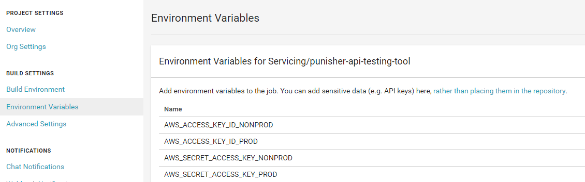

## Setting up HAL

1. Add your application to HAL
    - Fill out the dialog boxes with the relevant information:
        * Name: Name of your application
        * Organization: Organization (AWS Account) that you will be deploying to ( IAC Training for this class)
        * GitHub Repository: Link to the Git repo hosting your code and Dockerfile ( https://git.rockfin.com/training-iac/training-starter-kit/tree/master/workshop_materials/Docker/sample-container )
        * Provider: AWS
        * Platform: Linux
        * Language: .NET Core

2. Add deployment configuration
    - Select **Manually Add Deployment Target** to add configuration. Deployment config is required for each environment.
    - Select your environment (`test-aws`)
    - Select `script` for **Server**.
    - Enter your application name for the **Name** (Or whatever you like, its up to you).
    - Enter the region for **Script Context** (us-east-2 in our example)
    - Select your AWS credentials for **Credentials** ( Choose "IAC Training - NonProd" for our example) 
    - Repeat above steps for beta and make another deployment target for **beta-aws**.

## Setting up CI/CD

#### Configuring HAL

- Generate an access token that you will plug into CircleCI so that it can call HAL :key:
  * [HAL] On the [hal settings page](https://hal9000/settings) create a personal access token.
  * [HAL] For Token Type, select "Non prod Deployments" or "Prod deployments" as applicable.
  * [CircleCI] Go to the CircleCI page for your app and click the gear icon (https://circleci.foc.zone/)
  * [CircleCI] Go to the `Environment Variables` tab and add a variable called `HAL_API_TOKEN` with the value of the token you just generated.

- In your [.hal9000.yml](./CI_CD/hal9000.yml) file, replace the following values: 🔃
  * `HAL_ECS_CLUSTER` should reflect the ECS cluster name, for example : `test-ecscluster-418023852230-us-east-2`
  * `HAL_ECS_TASK` should reflect the name of your service in the ECS cluster. for example : `test-999999-YOURNAME`
  * `HAL_IMAGE_URL` should reflect your ECR URL, for example : `418023852230.dkr.ecr.us-east-2.amazonaws.com/test-999999-YOURNAME:${HAL_COMMIT}`
  * `HAL_TASK_ARN` should reflect your ECS task IAM role arn, for example: `arn:aws:iam::418023852230:role/QL/ECS/role-test-999999-YOURNAME`

#### Configuring CircleCI

- In your [.circleci/config.yml](./CI_CD/circleci/config.yml) file, replace the following with values that Team Sudo will provide 🔃
  * `CIRCLE_DOCKER_IMAGE_NAME` should reflect your application name, for example : `YOURNAME`
  * `CIRCLE_AWS_REGION` should reflect the AWS region you are in : `us-east-2`
  * `CIRCLE_TEST_ECR_URL` should reflect your ECR URL  : `418023852230.dkr.ecr.us-east-2.amazonaws.com/test-999999-YOURNAME`
  * `CIRCLE_BETA_ECR_URL` should reflect your ECR URL  : `418023852230.dkr.ecr.us-east-2.amazonaws.com/beta-999999-YOURNAME`

- In CircleCI, click the gear icon for your build to access the settings for your build, then click on "Environment Variables". Use this section to populate the IAM keys for the AWS account you are deploying to; this allows CircleCI to push docker images to ECR. You can get these keys from Team Sudo or one of your peers.

  </img>

